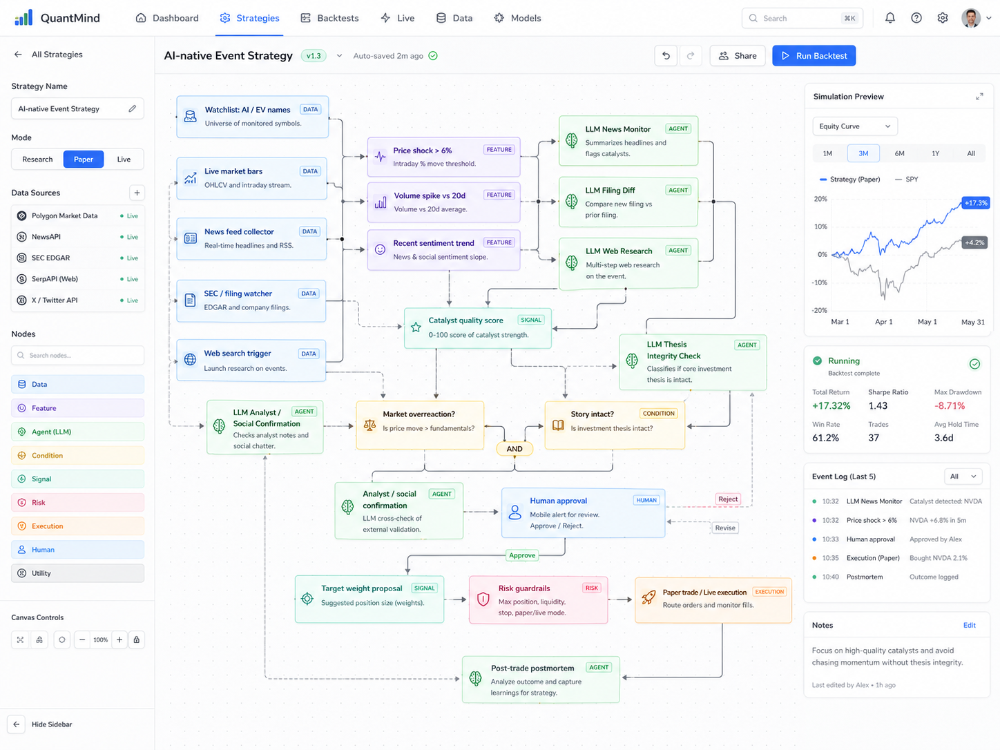
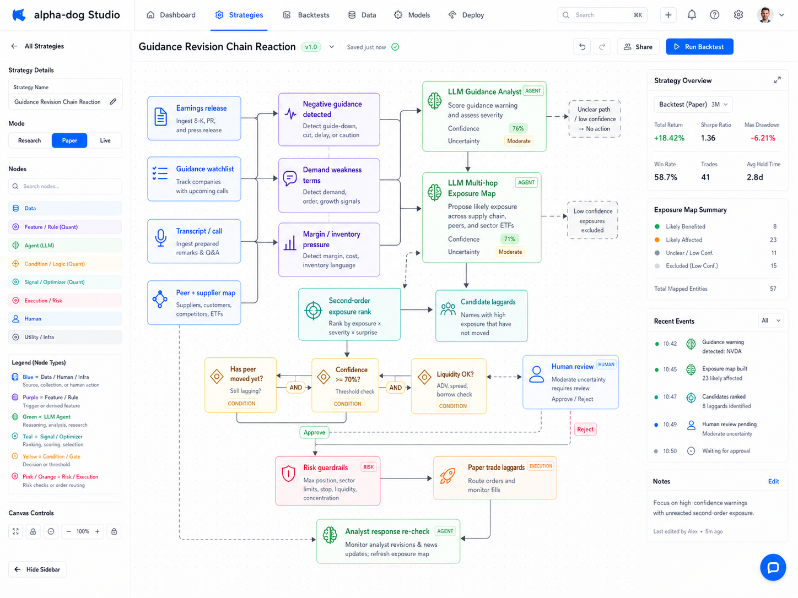
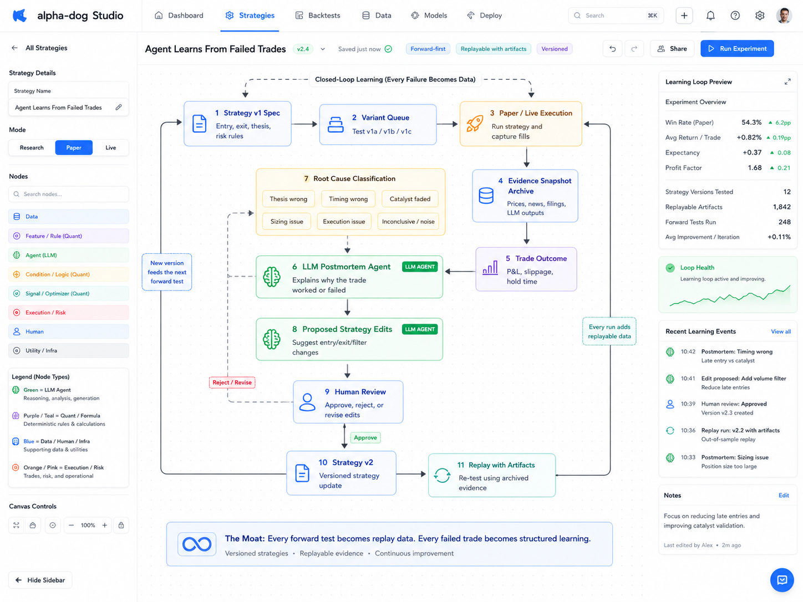

# Alpha-Dog: AI-native strategy workflows

## The idea

alpha-dog is not an "AI stock picker." It is an **AI-native strategy research and automation platform** that turns vague human trading and investing ideas into inspectable, testable, monitorable workflows.

The product flow is:

```text
User describes a vague strategy idea
-> AI copilot clarifies, parameterizes, and formalizes it
-> platform converts it into a typed workflow / decision tree / DAG
-> user sees the strategy as a visual wiring diagram: nodes, connections, gates, and outputs
-> workflow mixes deterministic quant nodes with LLM-agent judgment nodes
-> platform labels what is backtestable, replayable with artifacts, or forward-test-only
-> user runs backtests and paper forward tests across variants
-> system logs evidence, decisions, outcomes, and postmortems
-> live execution is optional, guarded, and human-approved
```

The core value is **not** that an LLM secretly decides what to buy. The core value is that an LLM helps formalize fuzzy portfolio-manager thinking into structured, auditable workflows with guardrails.

Traditional no-code strategy builders are good at rules like:

```text
If RSI < 30, buy.
If price crosses above the 200-day moving average, buy.
Rank ETFs by 60-day return.
Rebalance weekly.
```

alpha-dog is built for strategies that sound more like how professional portfolio managers actually think:

```text
If the selloff looks temporary rather than thesis-breaking,
and management's language has not deteriorated versus prior calls,
and the market-cap loss looks excessive relative to likely financial impact,
and peers have not yet adjusted,
then alert me with a proposed trade and supporting evidence.
```

That kind of strategy cannot be expressed as a simple indicator formula. It requires a chain of nodes: market data, portfolio state, news, filings, transcripts, web research, document interpretation, evidence-weighted causal hypotheses, confidence scoring, risk controls, and sometimes human approval.

The user experience should feel like this: state the idea in plain English, then watch the AI reduce it into a diagram that looks less like a spreadsheet and more like a circuit wiring diagram. One box fetches prices, another reads news, another compares a transcript, another produces a structured judgment, another checks risk, another asks for approval, and another sends the paper/live order. **The diagram is the strategy.**

## The edge

The platform's edge is a new strategy language where **LLM-agent nodes are first-class workflow components**.

An agentic node can perform one complex task or a multi-hop chain:

- search the web for fresh context
- read a filing, transcript, press release, court docket, FDA notice, or product announcement
- compare new language to prior language
- classify whether available evidence suggests news is material, promotional, temporary, structural, crowded, or thesis-breaking
- map plausible first-order news into second-order exposure across suppliers, customers, peers, and ETFs
- judge source credibility and confidence level
- extract typed fields from unstructured documents
- summarize evidence and uncertainty for a human approval gate
- archive inputs and outputs so forward tests become replayable artifacts later

The LLM should not be an opaque trading brain. Agentic nodes return **evidence-weighted judgments** with confidence, uncertainty, and an explicit `insufficient_evidence` path. Sometimes the right output is: "I found no reliable explanation yet; do not trade on this node."

The useful output is typed, auditable, and humble enough for deterministic nodes to consume:

```json
{
  "event_type": "earnings_call_tone_change",
  "demand_tone": "weaker",
  "margin_tone": "stable",
  "management_confidence": "lower_than_prior_quarters",
  "materiality_score": 74,
  "price_reaction_assessment": "possibly_excessive",
  "confidence": 0.68,
  "uncertainty": "moderate",
  "insufficient_evidence": false,
  "recommended_action": "review_required",
  "evidence": [
    "More cautious language around enterprise demand",
    "Repeated mention of longer sales cycles",
    "No explicit guide-down, but tone weaker than prior call"
  ]
}
```

Then deterministic rules make the workflow safe:

```text
IF materiality_score > 70
AND demand_tone == "weaker"
AND position_size > 3%
AND user_approval == true
THEN reduce position by 25%
```

## Worked example: from a paragraph to a workflow

A user types this into the copilot:

> I want something that watches AI stocks like NVDA, AMD, TSLA, PLTR. When one suddenly moves a lot, I want the AI to investigate what happened. Check news, filings, web search, analyst/social chatter, and score whether the evidence points to a real catalyst, noise, or an unclear case. If it looks like the market is overreacting but the company story still appears intact, ask me if I want to buy or adjust the position. Don't trade automatically — just paper trade after I approve. Also keep track of whether these decisions worked so the strategy can improve.

The copilot clarifies, parameterizes, and emits this workflow:



Reading the diagram left to right:

- **Watchlist + price/volume monitor** triggers when a name moves abnormally on volume.
- **Parallel evidence collectors** read news headlines, SEC filings, and run an LLM web-research agent in parallel.
- **A filing-diff node** compares any new filing against the prior one and extracts material changes.
- **A judgment node** consumes all of the above and produces a typed verdict: real catalyst / noise / overreaction / inconclusive — with confidence and supporting evidence.
- **Gates** check thesis intactness and reaction proportionality. If either fails, the workflow exits without action.
- **A position-sizer + risk-guardrail block** proposes size, max loss, stop level, and liquidity checks.
- **A human-approval node** sends a mobile alert with a one-paragraph rationale and approve/reject buttons.
- **A paper-trade execution node** records fills, slippage, and a snapshot of every input the agentic nodes saw.
- **A postmortem node** runs after exit, classifies the outcome (thesis correct/wrong, catalyst held/failed, noise), and versions the strategy with the lesson.

Every node is typed. Every agentic output has a confidence. Every input is archived. The deterministic gates are what make it safe; the agentic nodes are what make it possible.

This is the canonical shape of an alpha-dog strategy. Everything below is a variation on this pattern.

## Designing the strategy is a conversation, not a transcription

The worked example above shows the converged graph. The path to it is iterative. The copilot is built for users who do *not* have a fully-formed strategy in their head — who want to test an instinct, see what data is actually available, or evolve the workflow as they learn what the data looks like.

A real session looks more like this:

```text
User:    "I want something for AI/EV stocks that watches for big moves..."

Copilot: "When you say 'big move,' should I use a fixed % threshold, or
          something relative to each name's recent volatility? Here's
          how often each would have triggered on your watchlist over
          the last 90 days."
          [renders two histograms]

User:    "Use the volatility-adjusted one. Lower the threshold a bit."

Copilot: "For the news collector — every headline, or only ones that
          change the prior-day narrative? Here's the last week of NVDA
          news showing what each option would have caught."
          [renders side-by-side samples]

User:    "The second one. But also include analyst notes."

Copilot: "Quick sanity check: I ran just the trigger subgraph against
          last quarter. It would have fired 11 times. Want to see them?"

User:    "Show me the three you scored as 'real catalyst' with highest
          confidence."

Copilot: [pulls up the evidence snapshots from those three]

User:    "Two of those look right; one looks like noise. Why did the
          news collector miss the analyst downgrade on the third?"

Copilot: "The headline didn't reference the company by ticker. Want me
          to add a name-resolution step?"
```

This is what "the copilot helps you define a strategy" actually means in practice. It is closer to pair programming than to prompt engineering. Three capabilities make it work:

- **Subgraph dry-runs.** The copilot can execute any subgraph in isolation against historical data. A user undecided between three exit rules can have all three run against the same trigger set side-by-side, then pick from the rendered comparison. The user does not have to know the answer up front.
- **Side investigations into data sources.** Before signing off on any agentic node, the user can ask the copilot to sample what that node will actually see — last week of news for a ticker, last four earnings transcripts, last quarter of SEC filings, format of FDA notices, what a CourtListener docket entry actually looks like. This kills the most common no-code failure mode: users committing to a data source they have never inspected.
- **Cheap incremental editing.** Nodes can be added, removed, swapped, or split without rewriting the strategy. Each edit re-runs only the affected subgraph. A user can converge on a strategy in 30 minutes of dialogue rather than getting the prompt right on the first try.

The iterative design loop is itself a differentiator. Competitors that treat the natural-language input as a one-shot prompt force users to articulate strategies they do not yet have the vocabulary for. alpha-dog assumes the strategy *emerges* through conversation, backed by quick probes, subgraph dry-runs, and source inspection — and that the final diagram is the **output** of that process, not the input.

## Why existing AI/no-code builders cannot express this

Composer and Capitalise.ai both offer natural-language/no-code strategy creation and backtesting. The gap is that their positioning is mostly rules-based strategy construction, scenario automation, technical indicators, allocation trees, alerts, and execution.

alpha-dog's thesis is broader:

```text
Natural language -> hybrid LLM-research/quantitative-formulas
```

That workflow can include:

- deterministic market-data rules
- portfolio-state and exposure rules
- backtestable factor nodes
- active event-stream triggers
- passive document/news collectors
- web-search research agents
- SEC / FDA / court / transcript / status-page readers
- LLM classification and multi-hop reasoning nodes
- human approval gates
- paper/live execution adapters
- post-trade postmortem and strategy-version nodes

Most of the strategies below cannot be faithfully entered into a conventional no-code AI backtester as a single strategy. The actual edge depends on at least one ambiguous language-heavy node: *"is this news material?"*, *"did management tone worsen?"*, *"does the evidence suggest an overreaction?"*, *"which peers may be exposed?"*, *"does this filing change the thesis?"*

## Product architecture in one sentence

**Composer/Capitalise.ai-style strategy building, extended with typed LLM-agent nodes for news, filings, transcripts, documents, web research, judgment, human approval, forward testing, and strategy learning.**

The canonical node vocabulary:

- Market Data Node
- Portfolio State Node
- Technical Indicator Node
- Ranking / Selection Node
- News Feed Node
- Web Search Node
- SEC Filing Node
- FDA / Regulatory Node
- Court / Litigation Node
- Earnings Transcript Node
- Document Reader Node
- Sentiment / Narrative Node
- LLM Judgment Node
- LLM Multi-Hop Research Node
- Human Approval Node
- Risk Guardrail Node
- Paper Trade Node
- Live Execution Node
- Postmortem / Learning Node

## Six hero strategies

These six illustrate the topologies that competitors cannot express. Each has at least one load-bearing agentic node and at least one deterministic guardrail.

### 1. Earnings-call language deterioration

**Idea:** Sell or reduce companies when earnings calls sound more cautious than usual, even if headline numbers are okay.

**Workflow:** Monitor portfolio names with upcoming earnings → ingest release, prepared remarks, Q&A → LLM judgment node scores guidance tone, margin pressure, demand weakness, and language drift vs. prior quarters → deterministic gate on score and position size → optional next-day confirmation → human approval before reducing.

**Why AI helps:** This requires nuanced language comparison across quarters. Traditional quant tools cannot easily encode "management sounded evasive."

**Test mode:** Replayable with stored transcripts where available; forward-test for live use.

### 2. Buy the dip only if the story is intact

**Idea:** Buy high-conviction stocks after big drops, but only if the drop looks market-wide or temporary, not because the company thesis broke.

**Workflow:** Detect drop > X% → parallel collectors for market context, sector context, company-specific news, analyst actions, and any new filings → LLM judgment node returns a confidence-scored label (market-driven / sector-driven / company-specific / unclear) with explicit `insufficient_evidence` path → enter only on market/sector-driven labels above a confidence threshold → staged entry with technical confirmation → human alert.

**Why AI helps:** "Why is it down?" is often unclear. An agent can search current sources, separate plausible explanations from noise, and return a confidence-scored label rather than pretending certainty.

**Test mode:** Partially backtestable if news snapshots are archived; otherwise forward-only.

### 3. Guidance revision chain reaction

**Idea:** When one company warns about demand weakness, find exposed peers and suppliers before they react.

**Workflow:** Detect negative guidance from Company A → LLM multi-hop research node proposes likely affected suppliers, customers, competitors, and sector ETFs with reasoning → rank by second-order exposure → check whether each exposed name has already moved → trade laggards with explicit thesis logging → re-evaluate as analysts respond.



**Why AI helps:** This is a reasoning graph problem — "who else is affected?" — that no rule engine can express.

**Test mode:** Difficult to backtest; high-value forward-test candidate.

### 4. Competitor read-through

**Idea:** When one company reports, look for read-through implications for comparable peers before they report.

**Examples:** AMD/Nvidia, Home Depot/Lowe's, Delta/United, Uber/Lyft, Target/Walmart.

**Workflow:** Detect earnings report from Company A → LLM extracts read-through signals (demand, pricing, margins, inventory, customer behavior) with confidence → identify named peers → compare peer stock movement to inferred impact → enter peer trade if market has underreacted → close before/after peer earnings.

**Why AI helps:** The copilot reasons from one company's language to possible implications for another, while flagging "unclear" when the read-through is weak.

**Test mode:** Moderately backtestable using transcript history.

### 5. Personal watchlist thesis monitor

**Idea:** "I like these 20 companies. Alert me when the thesis changes — not every time there's news."

**Workflow:** User writes a thesis per name → copilot converts each thesis into monitorable claims (revenue growth above X, AI adoption continues, debt does not worsen, no major customer loss) → continuously monitor filings, earnings, news, transcripts, analyst commentary → alert only when thesis-relevant evidence appears → suggest action (ignore / review / reduce / buy more / exit).

**Why AI helps:** This turns vague conviction into explicit falsifiable criteria, then watches the world against them. It is the part of the analyst job that doesn't scale today.

**Test mode:** Forward-testable; some claim-checks can be simulated historically.

### 6. Agent learns from failed trades

**Idea:** After every trade, the copilot analyzes whether the strategy failed because the idea was bad, execution was bad, or market conditions changed.

**Workflow:** Log every trade with its intended thesis and the full evidence snapshot used → after exit, LLM postmortem classifies outcome (thesis correct/timing wrong, thesis wrong, catalyst failed, risk-management failure, random noise) → propose strategy edits (tighten entry, change exit, add filter) → flag weak strategies for human review and retirement → version strategies over time.

**Why AI helps:** This is where the platform stops being automation and becomes a research memory system. Every forward test compounds into proprietary trace data.

**Test mode:** Forward-first by definition.



The diagram makes the loop explicit. Every trade enters with an intended thesis and a snapshot of every input the agentic nodes saw. After exit, a root-cause classifier and postmortem agent decide *why* the outcome happened — not just *what* happened — and emit a typed lesson. Proposed strategy edits are reviewed by the user, then the strategy version increments and the evidence snapshot is archived. Over many cycles, the strategy is no longer the one the user originally drew — it is the one the platform's accumulated trace data argued into existence.

## Coverage zoo

The hero strategies above show the dominant topologies. The table below shows breadth — additional strategies the same node vocabulary expresses naturally. Each requires at least one agentic node; each treats the agent as an evidence-gatherer with explicit uncertainty, not an oracle.

| # | Strategy | Load-bearing agentic node | Notable sources |
|---|---|---|---|
| 1 | Analyst downgrade overreaction | Classify downgrade language (valuation / near-term / structural / accounting) | Analyst notes, prior reactions, transcripts |
| 2 | Filtered institutional & insider follow | Score signal quality of 13F/Form-4/disclosure trades vs. current narrative; distinguish symbolic from conviction buys | 13F, Form 4, congressional disclosures, news |
| 3 | Product launch / event reaction | Judge whether the event meaningfully beat or missed expectations | Live coverage, social, analyst notes, competitor reads |
| 4 | Wait-for-the-report conditional | Extract numbers and tone from a specific awaited document, compare to consensus | Company IR, SEC filings, newswires |
| 5 | FDA / biotech catalyst | Interpret approval/CRL/label language and trial endpoints | FDA calendar, PDUFA, advisory committee documents |
| 6 | Bad news but not bad enough | Estimate proportionality of market-cap loss to plausible financial damage | Headlines, company response, peer baselines |
| 7 | Narrative exhaustion classifier | Score narrative stage (early / accelerating / crowded / exhausted) | Narrative-stock news/social volume, price reactions to positive news |
| 8 | Breakout with substantive catalyst | Judge whether the underlying catalyst is real, vague, or hype | Breakout signal + news search |
| 9 | SEC filing surprise & dilution risk | Diff new filing vs prior; decode ATM/shelf/PIPE/convert language | EDGAR, S-3, 424B, 8-K |
| 10 | Supply-chain shock with exposure map | Map disruption to companies via geography, suppliers, logistics routes, commodity inputs | Disruption news, port data, freight, customs |
| 11 | Management credibility decay | Track promises vs. outcomes longitudinally; interpret executive turnover | Transcripts, prior guidance, 8-Ks, executive history |
| 12 | Investor day credibility | Compare new targets to prior claims; score realism of capital allocation and margin assumptions | Decks, transcripts, prior IR history |
| 13 | One-time conditional trade assistant | Watch a specific situation with expiration date, trigger on multi-condition match | User-specified sources |
| 14 | Promotion & low-quality issuer filter | Classify promotional tone, dilution history, suspicious press patterns | OTC filings, paid-promotion text, SEC suspensions, volume spikes |
| 15 | Portfolio exposure contradiction detector | Translate holdings into thematic exposures (AI hardware, rates, China, USD, etc.) and surface hidden bets | Holdings, factor maps, narrative tags |
| 16 | Strategy tournament & versioning | Formalize multiple ideas, rank by return/drawdown/explainability/slippage, flag weak strategies for review | Internal trace history |
| 17 | Macro report interpreter | Translate CPI/jobs/Fed-minutes/GDP nuance into sector-specific implications | Economic calendar, prior releases, market reaction data |
| 18 | Activist investor monitor | Extract activist identity, stake, requests, credibility, company response from 13D and letters | 13D, activist letters, proxy filings |
| 19 | Court docket & IP litigation monitor | Classify litigation/injunction risk and exposed revenue from new docket entries | CourtListener, USPTO, ITC, filings |
| 20 | Government contract & procurement events | Detect award/protest/renewal/cancellation and estimate beneficiary impact | SAM.gov, agency notices, 8-Ks |
| 21 | Credit & ratings cross-asset read-through | Connect bond spread widening, covenant pressure, and ratings rationale to equity risk | TRACE-like data, CDS, ratings releases, 10-Q |
| 22 | Geopolitical exposure monitor | Map sanctions, export controls, and conflict headlines to affected holdings and suppliers | OFAC, BIS, revenue geography, supply-chain data |
| 23 | M&A rumor quality classifier | Separate credible strategic reports from rumor churn using source quality and deal logic | News, deal reporters, options volume, financing context |
| 24 | Spin-off, buyback & special-situation tracker | Score whether announcements are meaningful relative to cash flow, dilution, valuation, and history | S-1/Form 10, 8-Ks, cash-flow data, share count |
| 25 | Controversy & litigation materiality filter | Score whether a controversy or NGO/legal action is likely to affect demand, regulation, costs, or reputation materially | News, litigation filings, regulator actions |

### Platform safety (sidebar, not a "strategy")

Independent of any specific strategy, alpha-dog enforces behavioral guardrails at the platform layer: cooldown rules after rapid losses, mandatory rationale capture before live execution, paper-only forced modes when trade frequency spikes outside the user's own baseline, and a written-checklist gate that the copilot administers. These exist to prevent bad trades, not generate good ones, and apply across every strategy on the platform.

## Why forward testing is central, not secondary

Many of the highest-value ideas cannot be honestly backtested unless the platform archived the source stream before the market move.

Examples:

- "Search the web for fresh reaction."
- "Read today's filing as soon as it drops."
- "Monitor HN chatter around this devtool company."
- "Wait for Tesla's delivery report and compare it to consensus."
- "Watch CourtListener for litigation updates before mainstream news notices."

The right testing modes are:

```text
Backtest:               fully replayable deterministic nodes
Replay with artifacts:  replay stored agentic inputs/outputs from prior forward tests
Forward paper test:     run live with pretend capital, archive everything
Live with approval:     optional, guarded, logged, and reversible where possible
```

This creates a compounding data advantage. Every forward test saves event inputs, LLM outputs, decisions, prices, slippage, and outcomes. Over time, alpha-dog builds a proprietary library of replayable agentic strategy traces — something no rules-based backtester accumulates.

## What the copilot does across a strategy session

As shown in the conversational example earlier, the copilot is not a code generator — it is a strategy analyst and compiler. Across a typical session it will:

```text
1.  Understand the vague idea.
2.  Identify the strategy archetype or compose several archetypes.
3.  Ask for missing parameters or propose defaults with provenance.
4.  Mark each parameter as user-specified, inferred, defaulted, needs confirmation, or unsafe.
5.  Emit a formal strategy spec.
6.  Render the workflow graph.
7.  Lint for lookahead bias, survivorship bias, data gaps, liquidity risk, and unsafe automation.
8.  Label each node as replayable, replayable-with-artifacts, or forward-only.
9.  Probe data sources and dry-run subgraphs so the user can see what nodes will consume before approving them.
10. Run backtests where honest.
11. Launch forward paper tests where historical replay would be fake.
12. Compare variants and suggest refinements.
13. Preserve version history and postmortems.
```

This is a capability checklist, not a strict sequence. Most sessions revisit several of these items multiple times — the user is in the loop throughout, and the graph is edited live as the conversation progresses.

This matters because users start with ambiguous language:

```text
"Buy the dip if the story is intact."
"Sell when the hype peaks."
"Avoid companies where management sounds less credible."
"Tell me if my portfolio is secretly just one big AI hardware bet."
"Watch this event and ask me before acting."
```

alpha-dog turns those into explicit workflows with measurable nodes, agentic judgments, and risk controls.

## MVP wedge

The base layer matches deterministic workflows that current products already handle:

- SMA crossover, RSI conditions, price/volume filters
- rank/select/rebalance allocation trees
- stop losses, take profits, drawdown rules
- Composer-style momentum rotation
- Capitalise.ai-style plain-English scenarios

The wedge is event-driven and thesis-driven workflows:

- Nvidia thesis monitor
- Tesla delivery report watcher
- FDA-news bouncer
- earnings transcript tone-change detector
- SEC filing surprise detector
- buy-the-dip classifier
- activist investor monitor

Those wedge examples immediately show why this is not just another no-code backtester. They require the exact thing alpha-dog is designed around: **LLM-agent nodes inside an auditable trading workflow.**

## Investor-facing positioning

**Short version:**

> alpha-dog is an AI-native strategy research and automation lab for event-driven, thesis-driven, and language-heavy investing ideas.

**More explicit version:**

> alpha-dog lets investors describe messy trading ideas in plain English, then converts them into inspectable workflows that combine market data, deterministic rules, LLM research agents, document analysis, forward testing, human approval, and paper/live execution.

**Visual version:**

> Type the investment idea in plain English. alpha-dog reduces it to a circuit-like workflow diagram where every node is inspectable, testable, and auditable.

**The wedge:**

> Existing no-code trading products help users automate formulas. alpha-dog helps users automate the research and judgment chain around a strategy, while keeping execution typed, auditable, and guarded.

**The moat:**

> The strategy graph, agentic-node schemas, source adapters, archived forward-test artifacts, and postmortem/versioning loop create a compounding workflow/data system. Every strategy becomes more explicit. Every forward test becomes future replay data. Every failed trade becomes structured learning.

## Why this can become a serious platform

The platform is not betting on one model predicting markets. It is betting on a durable workflow shift:

```text
Portfolio-manager language
-> typed strategy graph
-> deterministic execution engine
-> agentic research nodes
-> forward-test artifact archive
-> human approval gates
-> strategy memory and iteration
```

That is a credible AI-native product because it puts the LLM where it is strongest:

- language interpretation
- document extraction
- comparison across sources
- ambiguity handling
- multi-hop research
- evidence summarization
- helping users formalize vague ideas

And it keeps the deterministic engine where determinism matters:

- portfolio accounting
- backtesting
- risk limits
- order sizing
- execution mode
- audit logs
- replayability

## Bottom line

alpha-dog's opportunity is to own the space between no-code quant builders and full custom hedge-fund research infrastructure.

The user can say:

```text
Watch this situation.
Read the relevant sources.
Judge whether the thesis changed.
Check whether the market appears to have already reacted.
Ask me before acting.
Paper-test variants.
Learn from the outcomes.
```

Current AI-assisted no-code backtesters are not designed for that. alpha-dog is.
